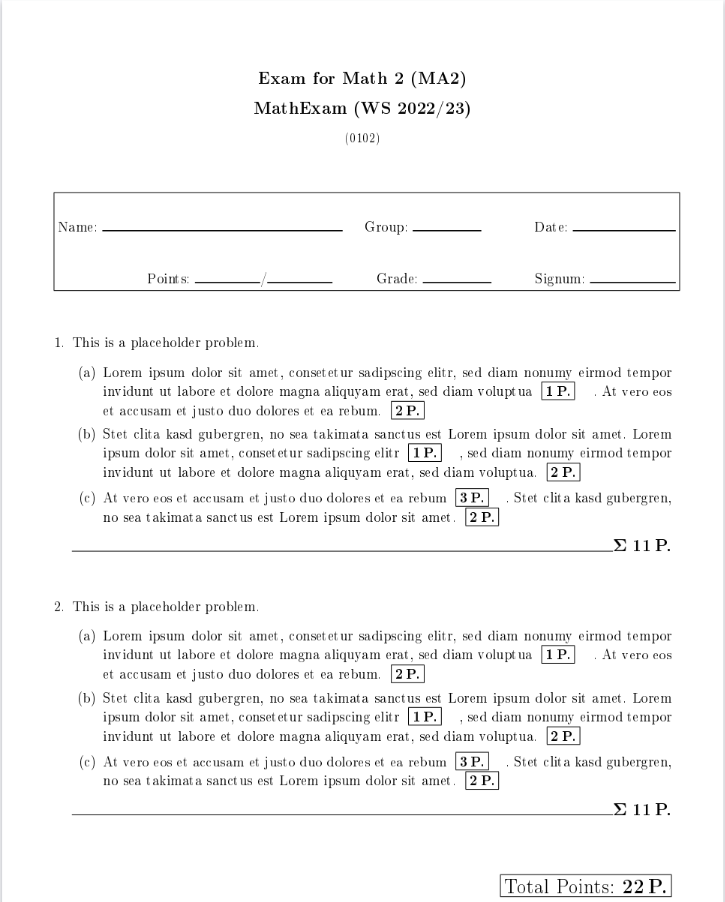

[](https://github.com/psf/black)
[](https://github.com/TUD-RST/examgenerator/actions)

# Exam Generator

Exam_generator is a script which is designed to create exams/ tests from 
pools of problems while ensuring that there will be no repetition amongst
different groups. Furthermore, you can create problems with values, randomly generated within
boundaries, provided in your LaTeX files.

## Installation


- clone the repository
- run `pip install -e .` (run from where the `settings` directory lives).

## Current Status and Issues

This project is currently in the development process and is set to release at the end of October 2022.

You can find the current issues [here](https://github.com/TUD-RST/examgenerator/issues)

## Documentation

Documentation for this project including a detailed user guide, tutorials and the API doc is available
on our [readthedocs page](https://exam-generator.readthedocs.io/en/latest/user_doc.html).
Optionally, you can also view our documentation locally, by executing any of the html files in our [docs directory](https://github.com/TUD-RST/examgenerator/tree/main/docs/build/html).

## Example

The exam generator allows quick creation of tests and exams.

With the following *directory setup*...

    C:.                                 ← Our current working directory                  
    ├───pool_data                       ← Directory for all different pool directories                
    │   ├───MC_easy                     ← Pool with easy multiple choice questions
    │   │       problem_1.tex
    │   │       problem_2.tex
    │   │       solution_1.tex
    │   │       solution_2.tex
    │   │
    │   └───MC_hard                     ← Pool with hard multiple choice questions
    │           problem_4.tex
    │           problem_5.tex
    │           solution_4.tex
    │           solution_5.tex 
    │
    ├───settings                        
    │       Math1.json                  ← Settings file 
    │
    └───templates                       ← LaTeX Templates
            template_problem.tex
            template_solution.tex 

in combination with these *settings*...

```
    {            
    "title": "Exam for Math 1 (MA1)",   ← The title that will be displayed on the exam
    "variant_name": "Math1",            ← Short handle displayed in the file names
    "semester": "WS 2022/23",           ← Current semester
    "copies": 1                         ← No parameterization used, no student specific copies needed
    "number_of_groups": 2,              ← Let's choose our maximum amount of possible groups                   
    "page_format_exam": "A4",           ← Students will get their exams printed out in A4 format      
    "page_format_solution": "A5",       ← Solution will be printed in A5 format

    "options":{
        "generate_single_pdfs": true,    ← We would like the option to look at the problems for each group seperately
        "generate_sumo_pdf": true,       ← We would like a sumo file
        "delete_temp_data": true         ← Deleteing temporary data is always usefull
    },
    "sumo_options":{                           
        "exam_copies": 20,               ← Count of how often, we would like to print the exam
        "solution_copies": 1             ← There is only one solution copy required
    },


    "exam":{                             ← Our exam is created here
        "Math Exam": [                   ← Name of the exam
        "MC_easy",                       ← Pool for first problem
        "proofs"                         ← Pool for second problem
        ]
    }
    }
```
with...

exam_generator -ct [path to settings file]

we can easily create an exam, looking like this:




